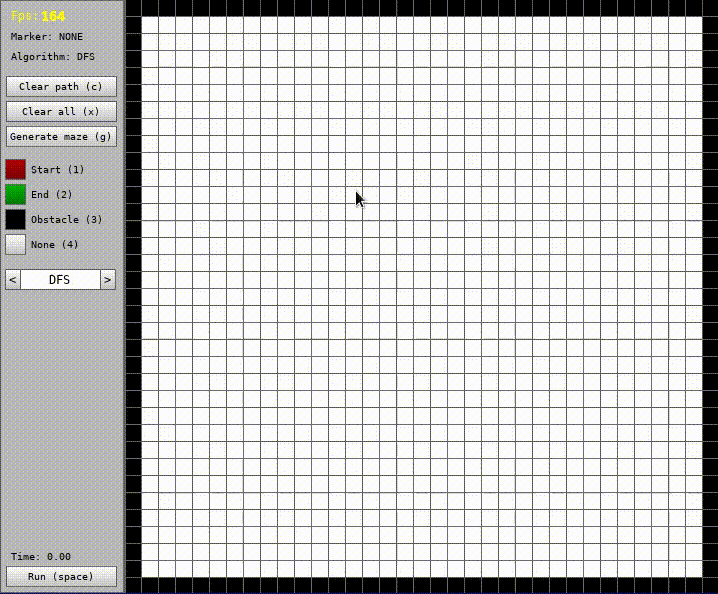

# General Info
This program was created to visualize path finding. It is written in Python.
It uses ```pygame``` library for graphical interface.
Currently there are three implemented algorithms:
* Depth-first search (DFS)
* Breadth-first search (BFS)
* A* search algorithm (AStar)

# Setup
To run this project you need pygame:
```
pip install pygame
```
then
```
python Main.py
```
to run program. <br /><br />
You can specify size of tile (-s) and number of tiles (-n) in a row:
```
python Main.py -s 8 -n 51
```
Number of tiles (-n argument) must be an odd number.<br /><br />
For more informations type:
```
python Main.py --help
```
Below you can see how it works: <br /><br />

